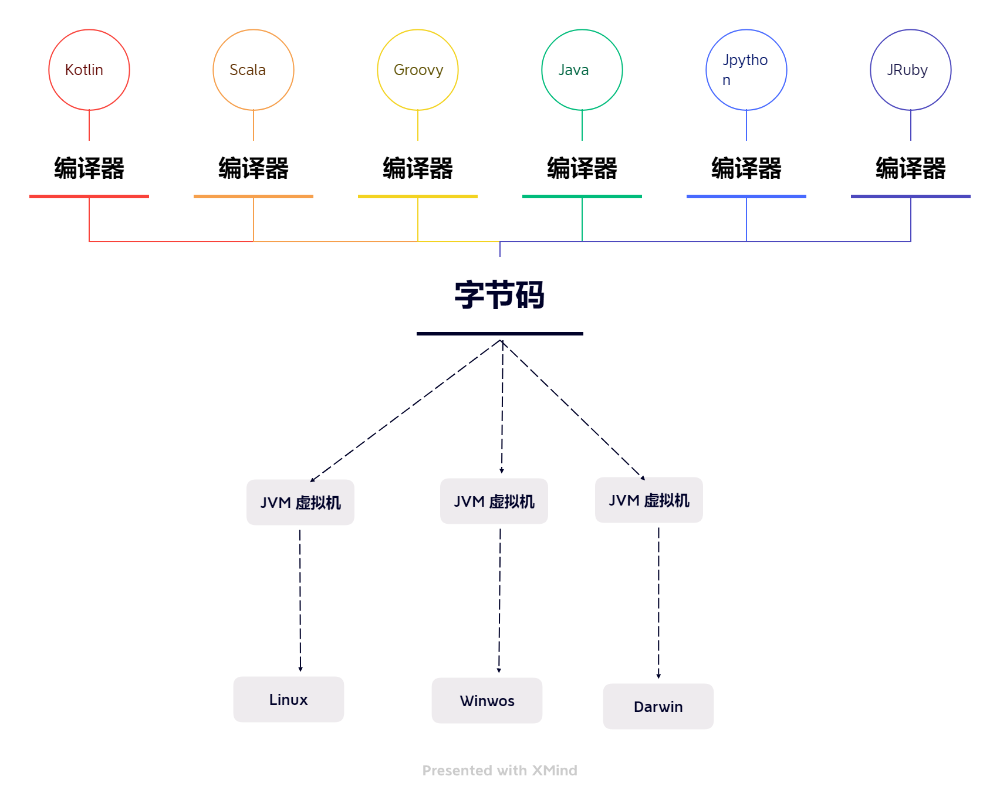
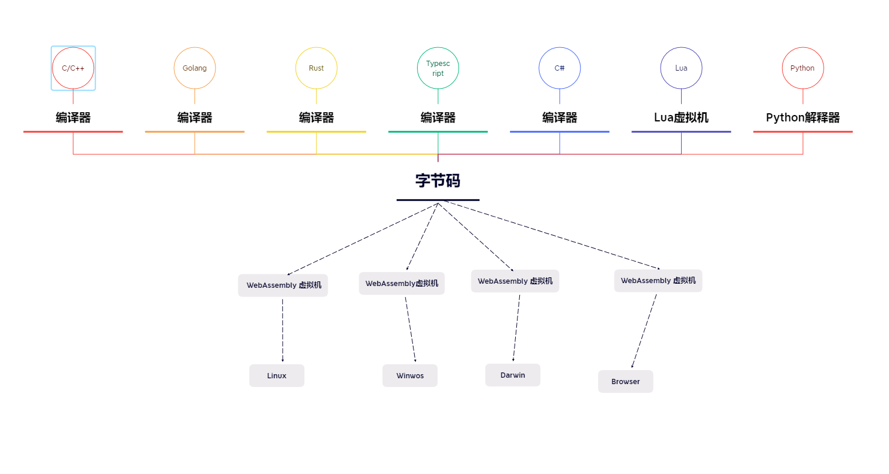

# 起源

```javascript
sum(1,3)

function sum(a,b) {
    return a + b
}
```
---

---
浏览器的的 v8 引擎性能已经达到了瓶颈，需要一种新的方式加速 web 端执行性能

---
# ASM.js
ASM 是 Javascript 的严格的子集，执行速度快
+ https://github.com/emscripten-core/emscripten
+ https://www.ruanyifeng.com/blog/2017/09/asmjs_emscripten.html

---
# WebAssembly是什么
WebAssembly 本身并不是一种编程语言,是一种高效的字节码标准，可以在现代的网络浏览器中运行 。JAVA 能运行在哪里，取决于 JVM 能运行在哪里，同样的 WebAssembly 虚拟机能在哪里运行，WebAssembly 就能在哪里运行。


---
# 现状
+ https://www.assemblyscript.org/ (typescript转WebAssembly)
+ https://wasi.dev/ (WebAssembly System Interface)
+ https://wapm.io/ (WebAssembly的包管理中心)
